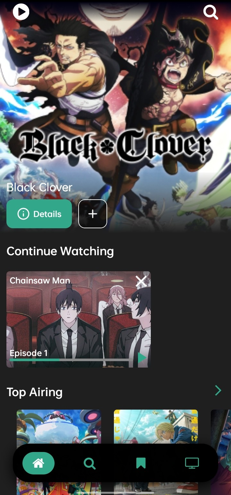
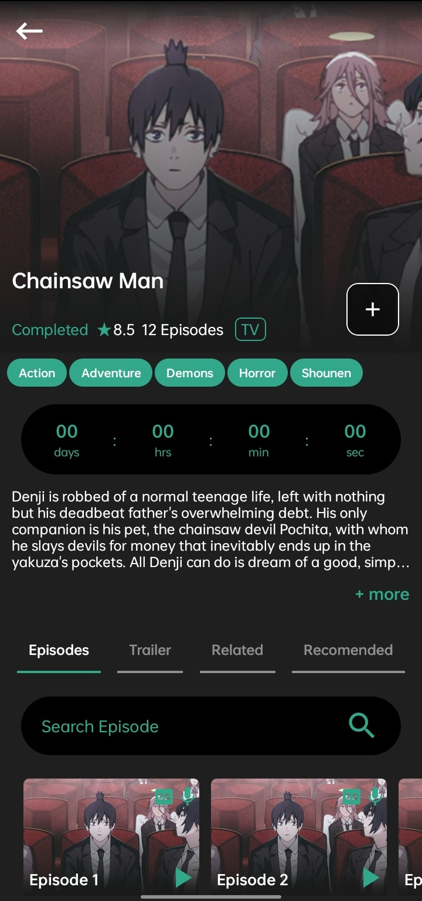
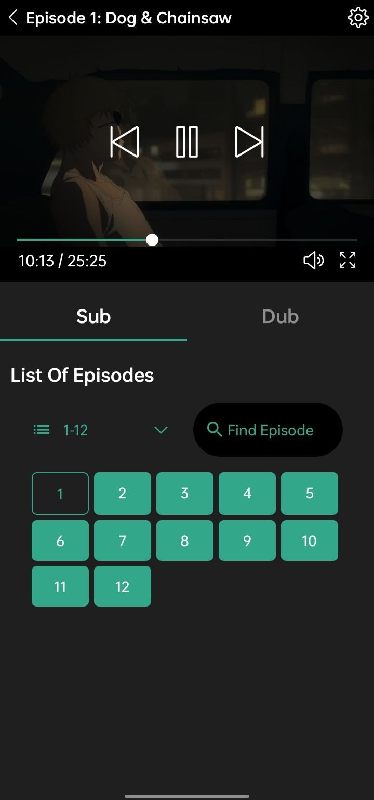
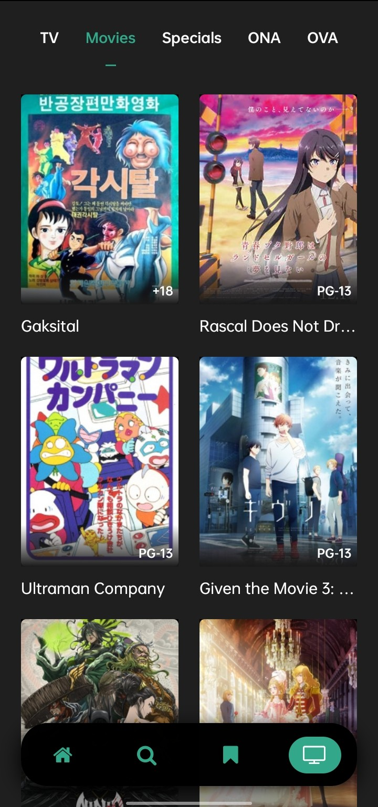
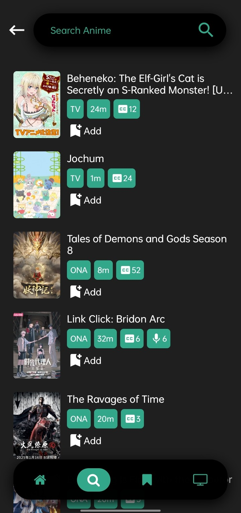

<h1 align="center">
  
   
  Zunesha
</h1>

  Anime streaming app built with React Native and Expo

## 📸 Screenshots

|                               Home & Discovery                                |                                Anime Details                                |                                   Video Player                                    |
| :---------------------------------------------------------------------------: | :-------------------------------------------------------------------------: | :-------------------------------------------------------------------------------: |
|  |  |  |

|                                  Random                                  |                                       Search                                       |
| :----------------------------------------------------------------------: | :--------------------------------------------------------------------------------: |
|  |  |

## Acknowledgements

[Consumet API](https://github.com/consumet/api.consumet.org)
